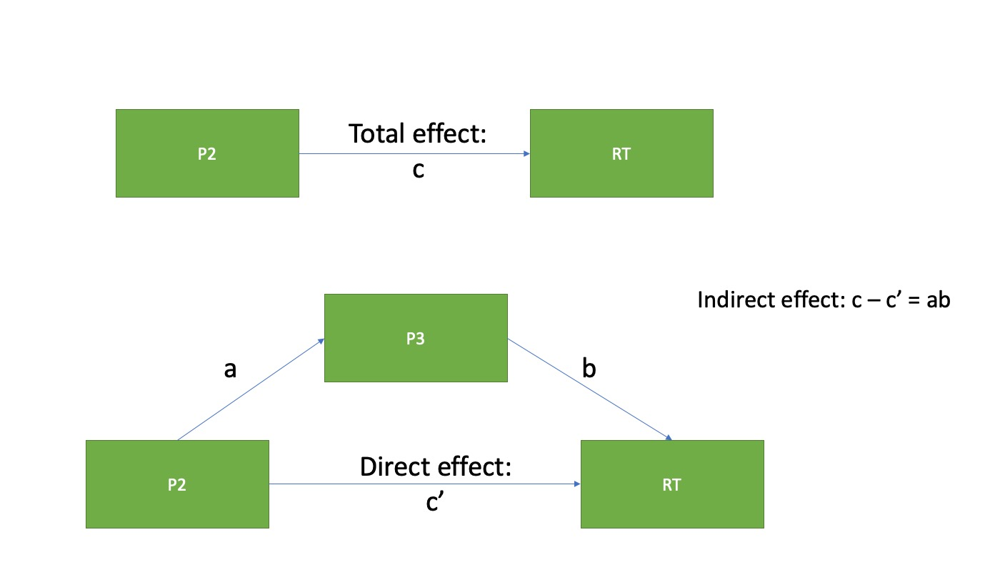

```{r setup, include=FALSE}
knitr::opts_chunk$set(echo = FALSE, 
                      warning = FALSE, 
                      out.width = "50%", # shrinks images by half when knitted to html
                      out.height = "50%")
library(lme4)
library(lmerTest)
library(dplyr)
library(knitr)
library(ggplot2)
library(MuMIn)
library(ggpubr)
library(cowplot)
library(kableExtra)
library(tidyr)
library(RMediation)


dat = read.delim("AllSubs_acceptedTrials_long_nobe_nobs_withRT_meancenteredP2_withP3_meancenteredP3.txt")

```

## <span style="color: LightSeaGreen;"> Theoretical mediation model
</span>



Approach:   
- Model 1 estimates *c* path (total effect), Model 2 estimates *a* path, Model 3 estimates *b* and *c'* path  
- Indirect effect calculated by multiplying *ab*  
- Asymmetric confidence limits approach used to calculate confidence interval estimate of indirect effect  
- Done separately for each task

## <span style="color: DarkSlateBlue;"> Race categorization task
</span>

## <span style="color: LightSeaGreen;"> Model 1: X -> Y
</span>
### <span style="color: DarkSlateGray;"> P2 amplitude predicting RT 
</span>
#### P2 amplitude is separated into within and between person effects

**Between person effect:**  
P2.submean = subject mean (separate subject mean for each electrode)  
**Within person effect:**  
P2.meancent = trial level P2 amplitude centered around subject/electrode mean   
**DV:**  
RT

Incorrect trials and trials with +/- 75 uV artifacts are excluded. Subjects with < 50% trials accepted are excluded (subs 36, 52, and 69). Sub 60 doesn't have data for gender task.

Total sample n = 68  
Included n = 65

```{r}
racedat = filter(dat, Task == "RaceTask")
# just include within and between
b1 = lmer(RT ~ P2.submean+P2.meancent + (1|Subject), data = racedat) 
# Electrode is not included as random variable because everything has been centered by electrode 
# (i.e. it doesn't contribute any variance)

sum.b1 = summary(b1)
sum.b1$call
sum.b1$varcor
table = round(sum.b1$coefficients, digits=3)
kable(table) %>% 
  kable_styling(full_width = F, position = "center") %>% 
  row_spec(which(table[,5] < .05), bold = T, background = "#FFFF66")

# specify a path (between and within) and standard error of a paths
c.between = sum.b1$coefficients[2,1]
c.within = sum.b1$coefficients[3,1]

c.se.between = sum.b1$coefficients[2,2]
c.se.within = sum.b1$coefficients[3,2]
```

## <span style="color: LightSeaGreen;">Model 2: X -> M
</span>
### <span style="color: DarkSlateGray;"> P2 amplitude predicting P3 latency 
</span>
#### P2 amplitude is separated into within and between person effects

**Between person effect:**  
P2.submean = subject mean (separate subject mean for each electrode)  
**Within person effect:**  
P2.meancent = trial level P2 amplitude centered around subject/electrode mean   
**DV:**  
PeakLat = P3 latency, not filtered

Incorrect trials and trials with +/- 75 uV artifacts are excluded. Subjects with < 50% trials accepted are excluded (subs 36, 52, and 69). Sub 60 doesn't have data for gender task.

Total sample n = 68  
Included n = 65

```{r}
# just include within and between
b2 = lmer(PeakLat ~ P2.submean+P2.meancent + (1|Subject), data = racedat) 
# Electrode is not included as random variable because everything has been centered by electrode 
# (i.e. it doesn't contribute any variance)

sum.b2 = summary(b2)
sum.b2$call
sum.b2$varcor
table = round(sum.b2$coefficients, digits=3)
kable(table) %>% 
  kable_styling(full_width = F, position = "center") %>% 
  row_spec(which(table[,5] < .05), bold = T, background = "#FFFF66")

# specify a path (between and within) and standard error of a paths
a.between = sum.b2$coefficients[2,1]
a.within = sum.b2$coefficients[3,1]

a.se.between = sum.b2$coefficients[2,2]
a.se.within = sum.b2$coefficients[3,2]
```

## <span style="color: LightSeaGreen;"> Model 3: X + M -> Y
</span>
### <span style="color: DarkSlateGray;"> P2 amplitude and P3 latency predicting RT
</span>
#### P2 amplitude and P3 latency both separated into within and between person effects

**Between person effects:**  
P2.submean = subject mean (separate subject mean for each electrode)
P3lat.mean = subject mean (separate subject mean for each electrode) , not filtered   
**Within person effects:**  
P2.meancent = trial level P2 amplitude centered around subject/electrode mean   
P3lat.meancent = trial level P3 amplitude centered around subject/electrode mean, not filtered  
**DV:**    
RT

Incorrect trials and trials with +/- 75 uV artifacts are excluded. Subjects with < 50% trials accepted are excluded (subs 36, 52, and 69). Sub 60 doesn't have data for gender task.

Total sample n = 68  
Included n = 65

```{r}
# just include within and between
b3 = lmer(RT ~ P2.submean+P3lat.mean+P2.meancent+P3lat.meancent + (1|Subject), data = racedat)
# Electrode is not included as random variable because everything has been centered by electrode 
# (i.e. it doesn't contribute any variance)

sum.b3 = summary(b3)
sum.b3$call
sum.b3$varcor
table = round(sum.b3$coefficients, digits=3)
kable(table) %>% 
  kable_styling(full_width = F, position = "center") %>% 
  row_spec(which(table[,5] < .05), bold = T, background = "#FFFF66")

# specify a path (between and within) and standard error of a paths
b.between = sum.b3$coefficients[3,1]
b.within = sum.b3$coefficients[5,1]

b.se.between = sum.b3$coefficients[3,2]
b.se.within = sum.b3$coefficients[5,2]

cprime.between = sum.b3$coefficients[2,1]
cprime.within = sum.b3$coefficients[4,1]

cprime.se.between = sum.b3$coefficients[2,2]
cprime.se.within = sum.b3$coefficients[4,2]

# How to check whether a and b covary??

```

## <span style="color: LightSeaGreen;">
Calculate indirect effect
</span>

**Between person effects:**  
*a* = `r round(a.between, digits=3) `, *se* = `r round(a.se.between, digits=3) `  
*b* = `r round(b.between, digits=3) `, *se* = `r round(b.se.between, digits=3) `    
*c* = `r round(c.between, digits=3) `, *se* = `r round(c.se.between, digits=3) `    
*c'* = `r round(cprime.between, digits=3) `, *se* = `r round(cprime.se.between, digits=3) `    
*ab* = `r round(a.between*b.between, digits=3) `    

**Within person effects:**  
*a* = `r round(a.within, digits=3) `, *se* = `r round(a.se.within, digits=3) `    
*b* = `r round(b.within, digits=3) `, *se* = `r round(b.se.within, digits=3) `    
*c* = `r round(c.within, digits=3) `, *se* = `r round(c.se.within, digits=3) `    
*c'* = `r round(cprime.within, digits=3) `, *se* = `r round(cprime.se.within, digits=3) `    
*ab* = `r round(a.within*b.within, digits=3) `  

## <span style="color: LightSeaGreen;">
Calculate confidence interval of estimate of indirect effect
</span>

First, calculate Sobel standard error:

<center>
$\sigma_{ab} = \sqrt{a^2\sigma_{b}^2 + b^2\sigma_{a}^2}$,   
where $\sigma_{a}$ and $\sigma_{b}$ are the standard errors of paths *a* and *b*.
</center>
<br>

Then, use the asymmetric confidence limits approach with the empirical-M critical values to get 95% CIs:

<center>
*Upper Limit* = *ab* + *(C.V. Upper)*($\sigma_{ab}$)  

*Lower Limit* = *ab* + *(C.V. Lower)*($\sigma_{ab}$)
</center>
<br>
The confidence intervals are calculated in RMediation using the empirical-M approach (also called distribution of products approach).

```{r}
CIs.between = medci(a.between, b.between, a.se.between, b.se.between, type="dop")
CIs.between.lower = round(CIs.between$`97.5% CI`[1], digits=3)
CIs.between.upper = round(CIs.between$`97.5% CI`[2], digits=3)
CIs.within = medci(a.within, b.within, a.se.within, b.se.within, type="MC")
CIs.within.lower = round(CIs.within$`97.5% CI`[1], digits=3)
CIs.within.upper = round(CIs.within$`97.5% CI`[2], digits=3)
```


**Between person indirect effect:**
<span style="color: Red;">
Indirect effect = `r round(CIs.between$Estimate, digits=3)` [`r CIs.between.lower`, `r CIs.between.upper`]
</span>

**Within person indirect effect:**
<span style="color: Red;">
Indirect effect = `r round(CIs.within$Estimate, digits=3)` [`r CIs.within.lower`, `r CIs.within.upper`]
</span>


## <span style="color: DarkSlateBlue;"> Gender categorization task
</span>

## <span style="color: LightSeaGreen;"> Model 1: X -> Y
</span>
### <span style="color: DarkSlateGray;"> P2 amplitude predicting RT 
</span>
#### P2 amplitude is separated into within and between person effects

**Between person effect:**  
P2.submean = subject mean (separate subject mean for each electrode)  
**Within person effect:**  
P2.meancent = trial level P2 amplitude centered around subject/electrode mean   
**DV:**  
RT

Incorrect trials and trials with +/- 75 uV artifacts are excluded. Subjects with < 50% trials accepted are excluded (subs 36, 52, and 69). Sub 60 doesn't have data for gender task.

Total sample n = 68  
Included n = 64

```{r}
gendat = filter(dat, Task == "GenTask")
# just include within and between
b1 = lmer(RT ~ P2.submean+P2.meancent + (1|Subject), data = gendat) 
# Electrode is not included as random variable because everything has been centered by electrode 
# (i.e. it doesn't contribute any variance)

sum.b1 = summary(b1)
sum.b1$call
sum.b1$varcor
table = round(sum.b1$coefficients, digits=3)
kable(table) %>% 
  kable_styling(full_width = F, position = "center") %>% 
  row_spec(which(table[,5] < .05), bold = T, background = "#FFFF66")

# specify a path (between and within) and standard error of a paths
c.between = sum.b1$coefficients[2,1]
c.within = sum.b1$coefficients[3,1]

c.se.between = sum.b1$coefficients[2,2]
c.se.within = sum.b1$coefficients[3,2]
```

## <span style="color: LightSeaGreen;">Model 2: X -> M
</span>
### <span style="color: DarkSlateGray;"> P2 amplitude predicting P3 latency 
</span>
#### P2 amplitude is separated into within and between person effects

**Between person effect:**  
P2.submean = subject mean (separate subject mean for each electrode)  
**Within person effect:**  
P2.meancent = trial level P2 amplitude centered around subject/electrode mean   
**DV:**  
PeakLat = P3 latency, not filtered

Incorrect trials and trials with +/- 75 uV artifacts are excluded. Subjects with < 50% trials accepted are excluded (subs 36, 52, and 69). Sub 60 doesn't have data for gender task.

Total sample n = 68  
Included n = 64

```{r}
# just include within and between
b2 = lmer(PeakLat ~ P2.submean+P2.meancent + (1|Subject), data = gendat) 
# Electrode is not included as random variable because everything has been centered by electrode 
# (i.e. it doesn't contribute any variance)

sum.b2 = summary(b2)
sum.b2$call
sum.b2$varcor
table = round(sum.b2$coefficients, digits=3)
kable(table) %>% 
  kable_styling(full_width = F, position = "center") %>% 
  row_spec(which(table[,5] < .05), bold = T, background = "#FFFF66")

# specify a path (between and within) and standard error of a paths
a.between = sum.b2$coefficients[2,1]
a.within = sum.b2$coefficients[3,1]

a.se.between = sum.b2$coefficients[2,2]
a.se.within = sum.b2$coefficients[3,2]
```

## <span style="color: LightSeaGreen;"> Model 3: X + M -> Y
</span>
### <span style="color: DarkSlateGray;"> P2 amplitude and P3 latency predicting RT
</span>
#### P2 amplitude and P3 latency both separated into within and between person effects

**Between person effects:**  
P2.submean = subject mean (separate subject mean for each electrode)
P3lat.mean = subject mean (separate subject mean for each electrode) , not filtered   
**Within person effects:**  
P2.meancent = trial level P2 amplitude centered around subject/electrode mean   
P3lat.meancent = trial level P3 amplitude centered around subject/electrode mean, not filtered  
**DV:**    
RT

Incorrect trials and trials with +/- 75 uV artifacts are excluded. Subjects with < 50% trials accepted are excluded (subs 36, 52, and 69). Sub 60 doesn't have data for gender task.

Total sample n = 68  
Included n = 64

```{r}
# just include within and between
b3 = lmer(RT ~ P2.submean+P3lat.mean+P2.meancent+P3lat.meancent + (1|Subject), data = gendat)
# Electrode is not included as random variable because everything has been centered by electrode 
# (i.e. it doesn't contribute any variance)

sum.b3 = summary(b3)
sum.b3$call
sum.b3$varcor
table = round(sum.b3$coefficients, digits=3)
kable(table) %>% 
  kable_styling(full_width = F, position = "center") %>% 
  row_spec(which(table[,5] < .05), bold = T, background = "#FFFF66")

# specify a path (between and within) and standard error of a paths
b.between = sum.b3$coefficients[3,1]
b.within = sum.b3$coefficients[5,1]

b.se.between = sum.b3$coefficients[3,2]
b.se.within = sum.b3$coefficients[5,2]

cprime.between = sum.b3$coefficients[2,1]
cprime.within = sum.b3$coefficients[4,1]

cprime.se.between = sum.b3$coefficients[2,2]
cprime.se.within = sum.b3$coefficients[4,2]

# How to check whether a and b covary??

```

## <span style="color: LightSeaGreen;">
Calculate indirect effect
</span>

**Between person effects:**  
*a* = `r round(a.between, digits=3) `, *se* = `r round(a.se.between, digits=3) `  
*b* = `r round(b.between, digits=3) `, *se* = `r round(b.se.between, digits=3) `    
*c* = `r round(c.between, digits=3) `, *se* = `r round(c.se.between, digits=3) `    
*c'* = `r round(cprime.between, digits=3) `, *se* = `r round(cprime.se.between, digits=3) `    
*ab* = `r round(a.between*b.between, digits=3) `    

**Within person effects:**  
*a* = `r round(a.within, digits=3) `, *se* = `r round(a.se.within, digits=3) `    
*b* = `r round(b.within, digits=3) `, *se* = `r round(b.se.within, digits=3) `    
*c* = `r round(c.within, digits=3) `, *se* = `r round(c.se.within, digits=3) `    
*c'* = `r round(cprime.within, digits=3) `, *se* = `r round(cprime.se.within, digits=3) `    
*ab* = `r round(a.within*b.within, digits=3) `  

## <span style="color: LightSeaGreen;">
Calculate confidence interval of estimate of indirect effect
</span>

First, calculate Sobel standard error:

<center>
$\sigma_{ab} = \sqrt{a^2\sigma_{b}^2 + b^2\sigma_{a}^2}$,   
where $\sigma_{a}$ and $\sigma_{b}$ are the standard errors of paths *a* and *b*.
</center>
<br>

Then, use the asymmetric confidence limits approach with the empirical-M critical values to get 95% CIs:

<center>
*Upper Limit* = *ab* + *(C.V. Upper)*($\sigma_{ab}$)  

*Lower Limit* = *ab* + *(C.V. Lower)*($\sigma_{ab}$)
</center>
<br>
The confidence intervals are calculated in RMediation using the empirical-M approach (also called distribution of products approach).

```{r}
CIs.between = medci(a.between, b.between, a.se.between, b.se.between, type="dop")
CIs.between.lower = round(CIs.between$`97.5% CI`[1], digits=3)
CIs.between.upper = round(CIs.between$`97.5% CI`[2], digits=3)
CIs.within = medci(a.within, b.within, a.se.within, b.se.within, type="MC")
CIs.within.lower = round(CIs.within$`97.5% CI`[1], digits=3)
CIs.within.upper = round(CIs.within$`97.5% CI`[2], digits=3)
```


**Between person indirect effect:**
<span style="color: Red;">
Indirect effect = `r round(CIs.between$Estimate, digits=3)` [`r CIs.between.lower`, `r CIs.between.upper`]
</span>

**Within person indirect effect:**
<span style="color: Red;">
Indirect effect = `r round(CIs.within$Estimate, digits=3)` [`r CIs.within.lower`, `r CIs.within.upper`]
</span>

